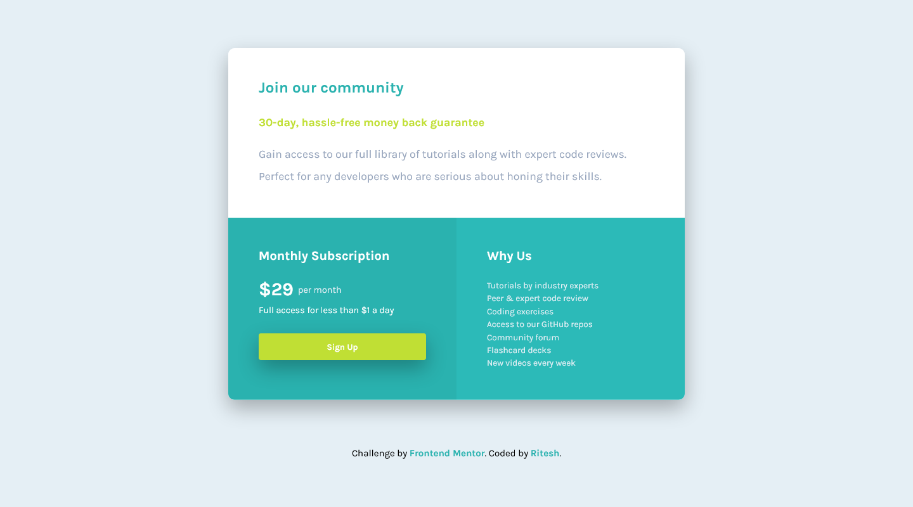

# Frontend Mentor - Single price grid component

## Welcome! 👋

# Frontend Mentor - Single price grid component solution

This is a solution to the [Single price grid component challenge on Frontend Mentor](https://www.frontendmentor.io/challenges/single-price-grid-component-5ce41129d0ff452fec5abbbc). Frontend Mentor challenges help you improve your coding skills by building realistic projects.

## Table of contents

- [Overview](#overview)
  - [The challenge](#the-challenge)
  - [Screenshot](#screenshot)
  - [Links](#links)
- [My process](#my-process)
  - [Built with](#built-with)
- [Author](#author)

## Overview

### The challenge

Users should be able to:

- View the optimal layout for the component depending on their device's screen size
- See a hover state on desktop for the Sign Up call-to-action

### Screenshot

### Links

- Solution URL: [Solution](https://www.frontendmentor.io/solutions/single-grid-component-w-css-grids-flexbox-media-query-hYIJHggF9)
- Live Site URL: [Live Site](https://b4n1y4.github.io/single-price-grid-component-master/)

## My process

### Built with

- Semantic HTML5 markup
- CSS custom properties
- Flexbox
- CSS Grid
- Mobile-first workflow

## Author

- Website - [Ritesh Gupta](https://github.com/b4n1y4)
- Frontend Mentor - [@b4n1y4](https://www.frontendmentor.io/profile/b4n1y4)
- Twitter - [@b4n1y4](https://www.twitter.com/b4n1y4)
